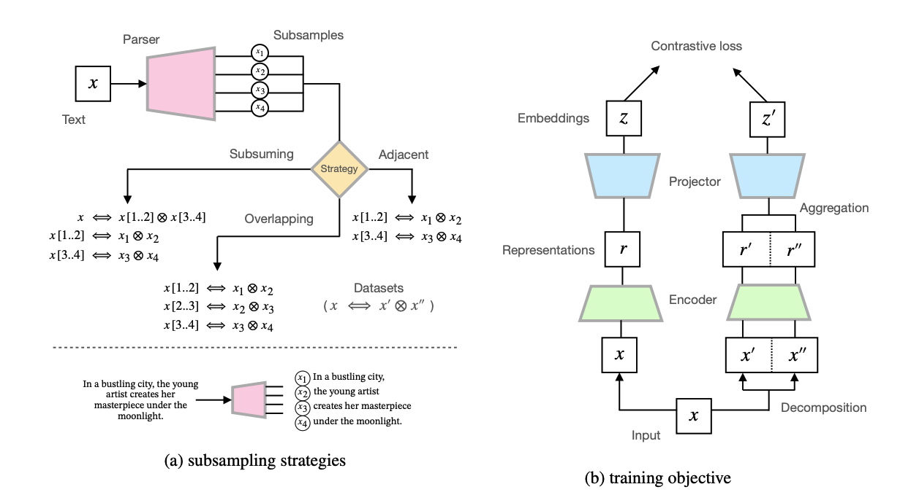

# Composition-contrastive Learning for Sentence Embeddings

This repository, adapted and mostly unchanged from [SimCSE](https://github.com/princeton-nlp/SimCSE), contains the code and pre-trained models for our ACL 2023 paper [Composition-contrastive Learning for Sentence Embeddings](https://arxiv.org/abs/2307.07380).

## Overview



TLDR; a new parameter-efficient baseline for learning text embeddings from unlabelled data, by maximizing alignment between texts and a composition of their phrasal constituents via the contrastive objective. We also show that subsampling texts to create "hard negatives" can benefit the alignment/uniformity tradeoff in model representations.  

**Note: I graduated from Texas A&M just before the conference, and lost access to the computing resources I used to conduct the experiments in this work. The code as it exists in this repo has been lightly tested, so I apologize in advance for any errors.**

## Setup

[](https://www.python.org/downloads/release/python-386/)
[](https://pytorch.org/get-started/previous-versions/)

### Requirements

First, install PyTorch by following the instructions from [the official website](https://pytorch.org). 

```bash
pip install torch==1.7.1+cu110 -f https://download.pytorch.org/whl/torch_stable.html
```

If you instead use **CUDA** `<11` or **CPU**, install PyTorch by the following command,

```bash
pip install torch==1.7.1
```

Then run the following script to install the remaining dependencies,

```bash
pip install -r requirements.txt
```

### Download the pretraining datasets

We used the [DMRST Parser](https://github.com/seq-to-mind/DMRST_Parser) and routines in ```RST.py``` to curate some of these datasets from the original corpus.

```bash
cd data
bash download_wiki.sh
bash download_curated_wiki.sh
```

### Download the downstream dataset

```bash
cd SentEval/data/downstream/
bash download_dataset.sh
```

## Training

```bash
python train.py \
    --model_name_or_path bert-base-uncased \
    --train_file ./data/partition_data_for_cse_v1.json \
    --output_dir <path_to_save_model_dir> \
    --num_train_epochs 1 \
    --per_device_train_batch_size 64 \
    --learning_rate 3e-5 \
    --max_seq_length 32 \
    --evaluation_strategy steps \
    --metric_for_best_model stsb_spearman \
    --load_best_model_at_end \
    --eval_steps 125 \
    --pooler_type cls \
    --mlp_only_train \
    --overwrite_output_dir \
    --temp 0.05 \
    --do_train \
    --do_eval \
    --compose_fn avg \
    --d0 256 \
    --fp16
```

Our new arguments:

* `--compose_fn`: how to aggregrate the phrase representations. For `bert-*`, we use `avg` and for `roberta-*`, we use `cat_first_last`, though our code can be easily extended to try other ways. 
* `--d0`: the size of the subvector used to compute the contrastive loss. For base (large) models, 768 (1024) means the entire vector.

For the results in our paper, we used an NVIDIA A100 GPU with CUDA 11.2. Using different types of devices or different versions of CUDA/Python/PyTorch may lead to slightly different performance.

## Evaluation

We can run the following command for evaluation:

```bash
python evaluation.py \
    --model_name_or_path <your_output_model_dir/hugging_face_model_dir> \
    --pooler cls_before_pooler \
    --task_set <sts|transfer|full> \
    --mode test
```

For more detailed information, please check [SimCSE's GitHub repo](https://github.com/princeton-nlp/SimCSE).

## Pretrained models

[](https://huggingface.co/perceptiveshawty)

* compositional-BERT-base: https://huggingface.co/perceptiveshawty/compositional-bert-base-uncased
* compositional-BERT-large: https://huggingface.co/perceptiveshawty/compositional-bert-large-uncased
* compositional-RoBERTa-base: https://huggingface.co/perceptiveshawty/compositional-roberta-base

We can load the models using the API provided by [SimCSE](https://github.com/princeton-nlp/SimCSE). 
See [Getting Started](https://github.com/princeton-nlp/SimCSE#getting-started) for more information.

## Citations

[](https://doi.org/10.48550/arXiv.2307.07380)

Please cite our paper and the SimCSE paper if they are helpful to your work!

```bibtex
@inproceedings{chanchani2023composition,
    title = {Composition-contrastive Learning for Sentence Embeddings},
    author = {Chanchani, Sachin and Huang, Ruihong},
    booktitle = {Proceedings of the 61st Annual Meeting of the Association for Computational Linguistics (Volume 1: Long Papers)},
    publisher = {Association for Computational Linguistics},
    year = {2023},

}

@inproceedings{gao2021simcse,
   title={{SimCSE}: Simple Contrastive Learning of Sentence Embeddings},
   author={Gao, Tianyu and Yao, Xingcheng and Chen, Danqi},
   booktitle={Empirical Methods in Natural Language Processing (EMNLP)},
   year={2021}
}
```
